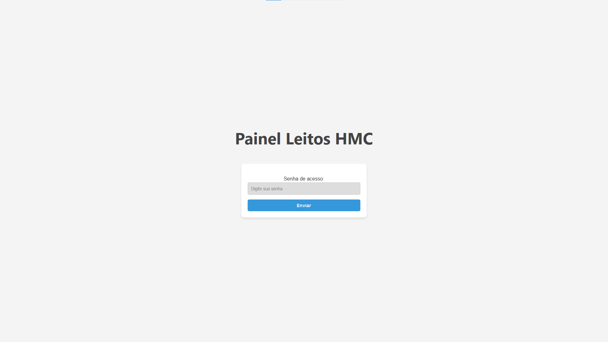
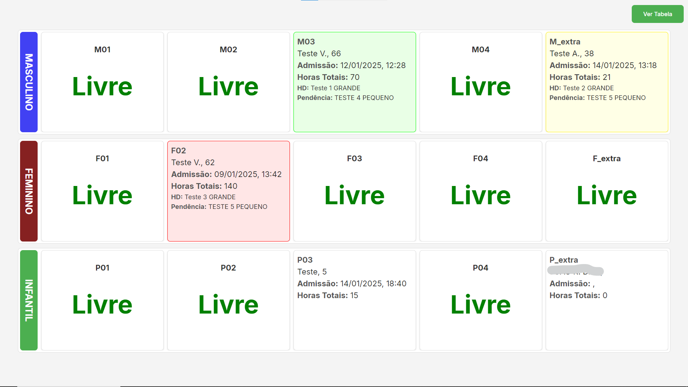
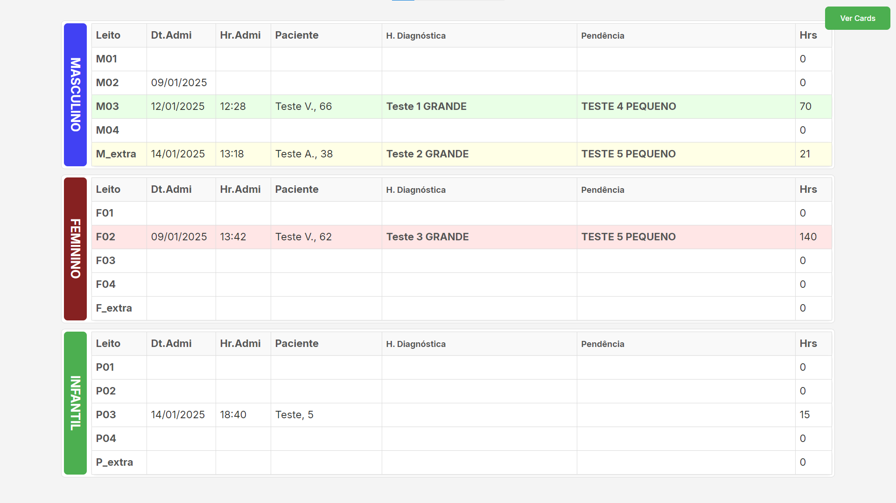

# Painel Google Sheets

Este projeto é uma solução para monitoramento e organização, integrando o Google Sheets como fonte de dados para um painel interativo desenvolvido com Python (FastAPI) e Vue.js.

<p align="center">
  
  
  
</p>

---

## Funcionalidades
- Visualização dinâmica separada por categorias: Personalizável.
- Atualização automática a cada minuto.
- Sistema de autenticação para controle de acesso.
- Integração direta com o Google Sheets para leitura de dados.

---

## Requisitos

- **Python 3.8+**
- **Node.js 16+**
- **Conta Google** com acesso ao Google Sheets.
- **Credenciais** de API do Google (JSON).
- **FastAPI** e bibliotecas relacionadas (veja abaixo).

---

## Configuração do Ambiente

### 1. Clone o repositório
```bash
git clone <URL_DO_REPOSITORIO>
cd <PASTA_DO_PROJETO>
```

### 2. Configure o ambiente virtual (venv)
```bash
python -m venv venv
source venv/bin/activate   # Linux/macOS
venv\Scripts\activate    # Windows
```

### 3. Instale as dependências do backend
```bash
pip install -r requirements.txt
```

### 4. Instale o Vue.js com Vite

1. Acesse a pasta `kanban-app`:
```bash
cd kanban-app
```

2. Instale o Vite:
```bash
npm install
```

---

## Integração com o Google Sheets

1. **Obtenha as credenciais da API do Google:**
   - Acesse [Google Cloud Console](https://console.cloud.google.com/).
   - Crie um novo projeto ou selecione um existente.
   - Ative a API do Google Sheets e a API do Google Drive.
   - Crie uma chave de serviço e baixe o arquivo JSON.

2. **Configure as credenciais no projeto:**
   - Renomeie o arquivo JSON para `credenciais.json`.
   - Coloque o arquivo na pasta raiz do projeto.

3. **Configure o ID da planilha e a senha:**
   - Crie um arquivo `sheet_id.txt` na raiz do projeto.
   - Insira o ID da planilha na primeira linha.
   - Insira a senha de acesso na segunda linha.

Exemplo do `sheet_id.txt`:
```
1x2x3x4x5x6x7x8x9x0
minha_senha_super_segura
```

---

## Personalização do Código

### 1. Atualize os headers esperados no `main.py`
Abra o arquivo `main.py` e atualize a lista `expected_headers` com os cabeçalhos da sua planilha do Google Sheets.

```python
# filepath: /c:/Users/rafael.marcal/Documents/GitHub/googlesheets-py_vue/main.py
# ...existing code...
expected_headers = [
    "Data de admissão", "Hora admissão",
    "Nome do Paciente", "Idade", "Sexo", 
    "Hipótese Diagnóstica", "Leito", "Pendências", 
    "Tempo de Perm.", "Necessário fazer AIH?", "AIH Feita?", "Hrs. AIH Feita"
]
# ...existing code...
```

### 2. Atualize os campos do card no `KanbanBoard.vue`
Abra o arquivo `KanbanBoard.vue` e atualize os campos do card para corresponder aos dados da sua planilha.

```vue
// filepath: /c:/Users/rafael.marcal/Documents/GitHub/googlesheets-py_vue/kanban-app/src/components/KanbanBoard.vue
// ...existing code...
<div class="kanban-card" v-for="(card, index) in cards" :key="index"
    :class="{ highlight_yellow: card.TotalHoras >= 20 && card.TotalHoras < 24, highlight_red: card.TotalHoras >= 24, highlight_green: card.AIHFeita === 'Sim' }">
    <div v-if="card.Nome">
        <div class="card-row texto-grande">
            <span><strong>{{ card.Leito }}</strong></span>
        </div>
        <div class="card-row texto-grande">
            <span>{{ card.Nome ? (nomeAbreviado(card.Nome) + (card.Idade ? ", " + card.Idade : "")) : "" }}</span>
        </div>
        <div class="card-row texto-grande">
            <span><strong>Admissão:</strong> {{ card.DataAdmissao + ", " + card.HoraAdmissao.slice(0, -3) }}</span>
        </div>
        <div class="card-row texto-grande">
            <span><strong>Horas Totais:</strong> {{ card.TotalHoras || "0" }}</span>
        </div>
        <div class="card-row texto_medio">
            <span><strong>{{ card.Hipotese ? "HD:" : "" }}</strong> {{ card.Hipotese }}</span>
        </div>
        <div class="card-row texto_medio">
            <span><strong>{{ card.Pendencia ? "Pendência:" : "" }}</strong> {{ card.Pendencia }}</span>
        </div>
    </div>
    <div v-else>
        <div class="leito_livre">
            <p><strong>{{ card.Leito }}</strong></p>
            <h1 style="color: green;">Livre</h1>
        </div>
    </div>
</div>
// ...existing code...
```

---

## Executando o Backend

1. Inicie o servidor FastAPI:
```bash
uvicorn main:app --reload
```

2. O backend estará acessível em:
```
http://127.0.0.1:8000
```

---

## Executando o Frontend

1. Acesse a pasta do frontend:
```bash
cd kanban-app
```

2. Inicie o servidor do Vite:
```bash
npm run dev
```

3. O frontend estará acessível em:
```
http://127.0.0.1:5173
```

---

## Rotas da API

### 1. Autenticação
- **Endpoint:** `/authenticate/`
- **Método:** POST
- **Corpo da requisição:**
```json
{
  "input_password": "sua_senha"
}
```
- **Resposta:**
```json
{
  "status": "success" ou "error"
}
```

### 2. Dados do Kanban
- **Endpoint:** `/kanban-data/`
- **Método:** GET
- **Cabeçalho:**
```
password: sua_senha
```
- **Resposta:** Dados estruturados para exibição no painel.

---

## Estrutura do Projeto
```
/
|-- backend/
|   |-- main.py
|   |-- credenciais.json
|   |-- sheet_id.txt
|
|-- kanban-app/
|   |-- src/
|   |-- vite.config.js
|
|-- README.md
```

---

## Personalização

- **Adicionar colunas na planilha:** Certifique-se de atualizar a lista `expected_headers` no arquivo `main.py` para refletir as novas colunas.
- **Alterar senha:** Atualize a segunda linha do arquivo `sheet_id.txt`.

---

## Dúvidas ou Sugestões
Sinta-se à vontade para criar uma issue ou contribuir com melhorias neste projeto!
